[](https://travis-ci.com/Shot511/RapidGL)

# RapidGL
Framework for rapid OpenGL demos prototyping.

This framework consists of two major parts:
* **Core library** - which is used as a static library for all examples. Source files are located in ```src/core```.
* **Demos**. Source files are located in ```src/demos```.

## How to build
Make sure to clone the repository with one of the following commands (to also clone the dependencies):

```
git clone --recurse-submodules -j8 https://github.com/Shot511/RapidGL.git

OR

git clone --recurse-submodules https://github.com/Shot511/RapidGL.git

OR

git clone --recursive https://github.com/Shot511/RapidGL.git
```

If you've already cloned the repo run the following command in the root directory to also clone dependencies:

```git submodule update --init --recursive```


Then run the following command in the root directory to generate project files:

```
cmake -B build
```

These will create project with your system-default build system which will allow you to build and run the examples.

## How to add a new demo using Template Project

The following instructions are also located in ```src/demos/00_template_project/template_project.h```.

To begin creating a new demo using RapidGL framework follow these steps:

1) Create new directory in ```src/demos/<your_dir_name>```.
2) Add the following line to ```src/demos/CMakeLists.txt```: ```add_subdirectory(<your_dir_name>)```.
3) Copy contents of ```src/demos/00_template_project``` to ```src/demos/<your_dir_name>```.
4) Change target name of your demo in ```src/demos/<your_dir_name>/CMakeLists.txt``` from ```set(DEMO_NAME "00_template_project")``` to ```set(DEMO_NAME "your_demo_name")```.
5) (Re-)Run CMake

**Notes:** After changing class name from e.g. TemplateProject to something else, update ```main.cpp``` in ```<your_dir_name>``` accordingly.

## Examples
All of the demos are available in ```src/demos```.

### Template Project
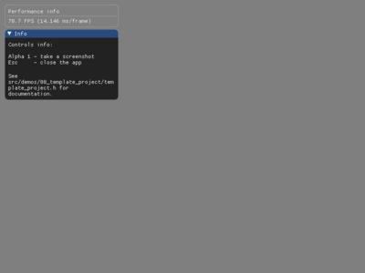

### Simple Triangle
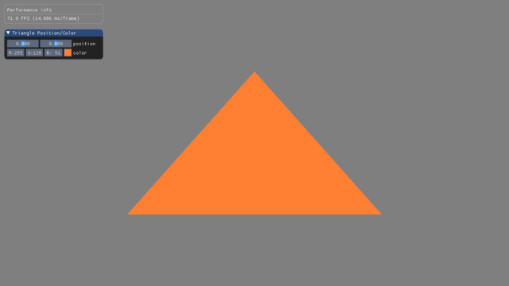

### Simple 3D
This demo shows how to create camera, load models, generate primitives using built-in functions and add textures for specific objects.

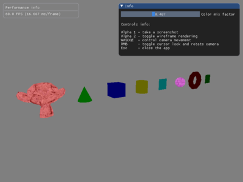

### Lighting
This demo presents implementation of Blinn-Phong shading model for directional, point and spot lights.

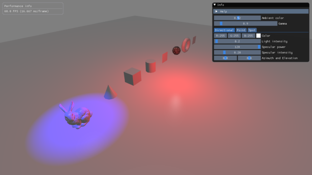

### Multitextured terrain
This demo presents implementation of multitextured terrain. It uses a blend map (for varying X-Z texturing) and slope based texturing (for texturing the slopes).

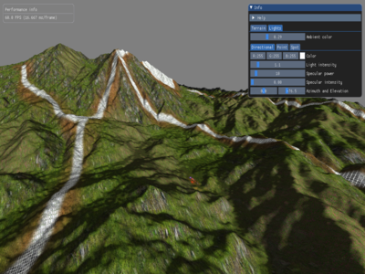

### Toon shading
This demo presents implementation of various toon shading methods (Simple, Advanced, Simple with Rim, Twin Shade) with different outline rendering methods (Stencil, Post-Process).

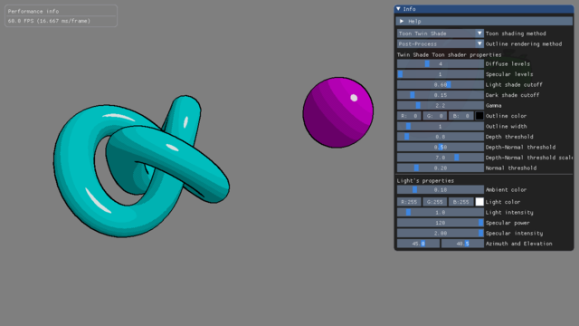

### Simple Fog
Implementation of a simple fog rendering. Three modes are available: linear, exp, exp2.

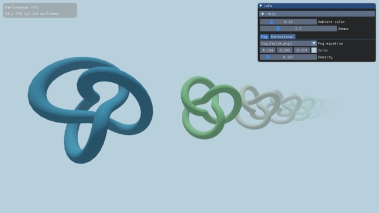

### Alpha Cutout
This demo shows implementation of an alpha cutout using fragments discarding.

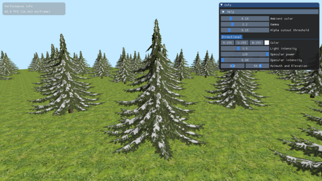

### Environment mapping
Implementation of dynamic and static environment mapping (light reflection and refraction).

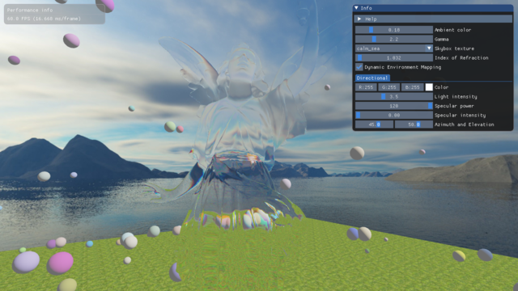

### Projected texture
Demo presents projecting a texture onto a surface.

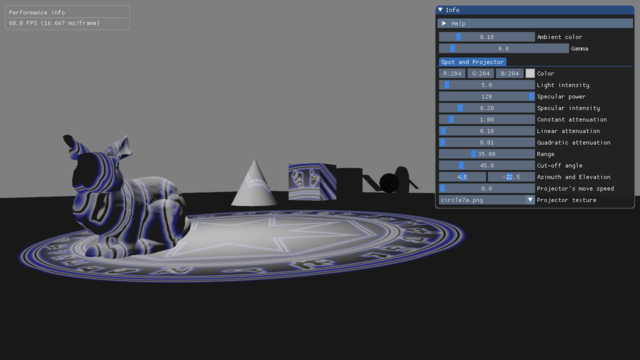

### Postprocessing filters
Negative, edge detection (Sobel operator) and Gaussian blur filters demo.

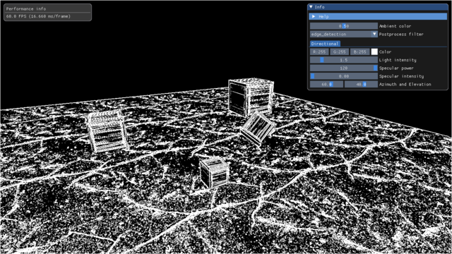

### Geometry Shader: Point Sprites
Demo presents generation of quad sprites from points data using Geometry Shader.

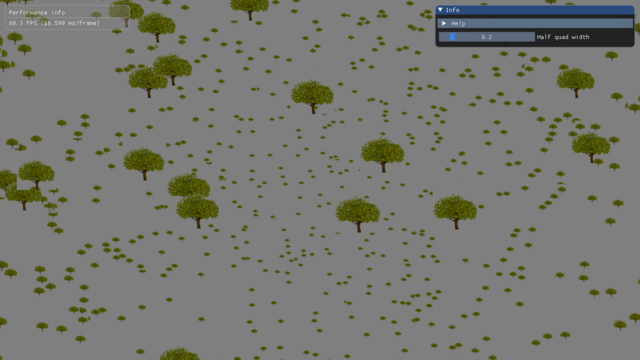

### Geometry Shader: Wireframe on top of a shaded model
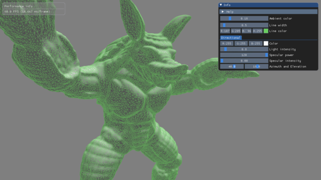

### Tessellation - 1D
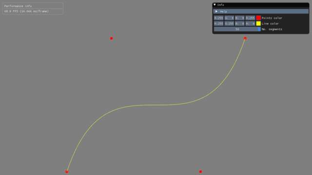

### Tessellation - 2D
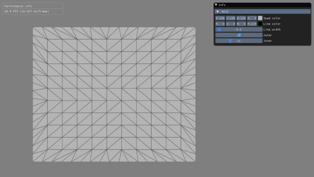

### PN Triangles Tessellation with Level of Detail
This demo implements Point-Normal tessellation algorithm (see *main.cpp* for references) with depth based level of detail (NOTE: works for each mesh with vertex normals).

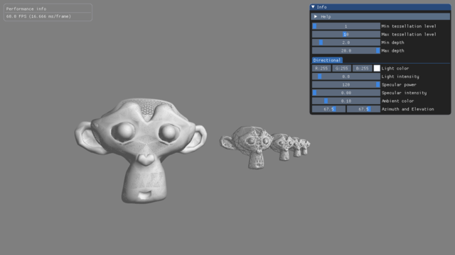

### Procedural noise textures
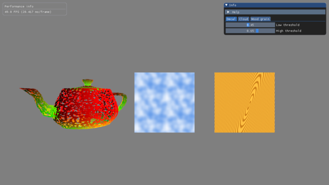

### Surface animation with vertex displacement
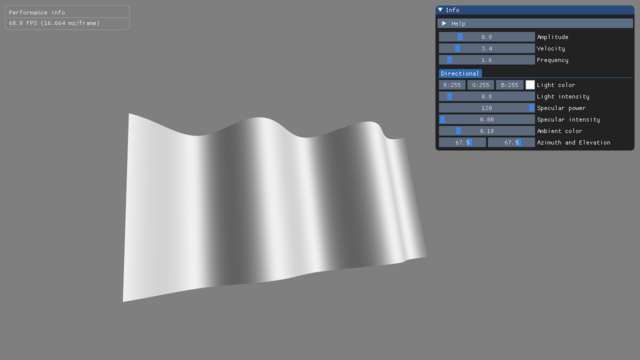

### Simple particle system using Transform Feedback
Available presets: fountain, fire and smoke.

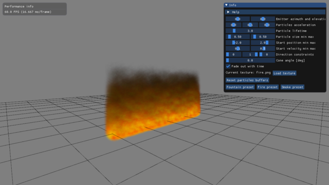

### Particle system using instanced meshes
TODO

### Particle system with the Compute Shader
TODO

### Shadow Mapping
TODO: Shadow Mapping with PCF, random sampling.

### Mesh skinning
TODO: LBS, DQS.

### OIT
TODO

### PBR
TODO
